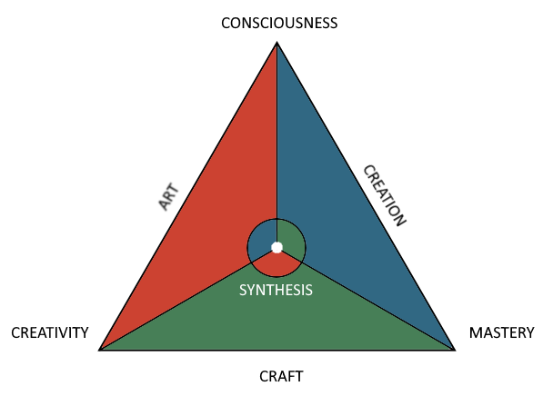

# Philosophical Triangle

A modular concept and visual model of a philosophical system based on the interaction of **Creativity**, **Mastery**, and **Consciousness** — forming a triangle whose internal harmony gives rise to **Synthesis**.

  

## Concept

The **Philosophical Triangle** is structured on three intersecting layers:

1. **Philosophy Layer**
   - Creativity *(abbr. as Cr)*
   - Consciousness *(abbr. as Co)*
   - Mastery *(M)*

2. **Psychological Layer**
   - **Creators** — expressive individuals with impulsive and fast-reacting nervous systems
   - **Intellectuals** — reflective and analytical thinkers with flexible nervous responses
   - **Professionals** — balanced and practical individuals with slow-reacting nervous systems

3. **Social Layer**
   - Declarers
   - Balancers
   - Result-driven

Each layer reflects a deep aspect of human nature, action, or society, unified through the geometric metaphor of a triangle. The model supports modular visualization, allowing translation, decorative customization, and interaction modes.

## Features

- Interactive geometric structure (matplotlib + Jupyter)
- Configurable triangle with dynamic point motion
- Extendable system for translations, UI themes, and behavioral modules

## Author

Created by [Yggge](https://github.com/Yggge)  
Idea and development by **Yggge**

## License

This work is licensed under a [Creative Commons Attribution-NonCommercial-NoDerivatives 4.0 International License](https://creativecommons.org/licenses/by-nc-nd/4.0/).

---

> 🧩 This project is in active development. Modular extensions (visual design, translation layers, experimental features) are planned.
